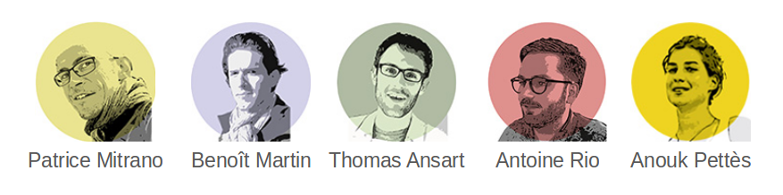
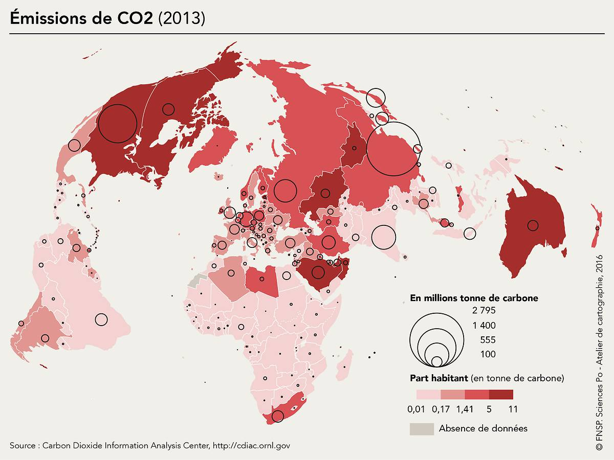
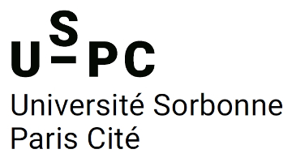
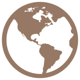
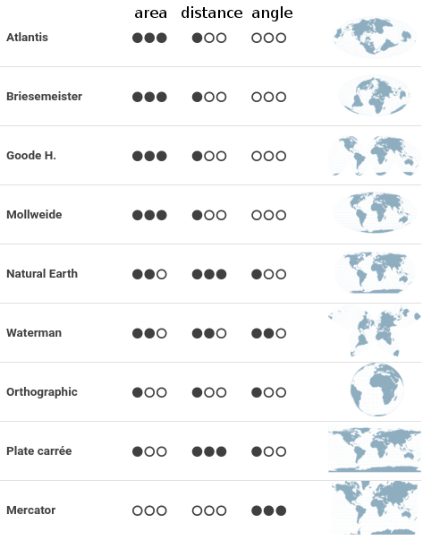
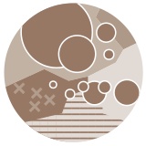

<h1 id="main">
Khartis <em>How to simply create thematic maps in three steps ?
</em></h1>
 

  Paul Girard ‑ Benjamin Ooghe Tabanou - Audrey Baneyx 
  Sciences Po médialab, Paris, France

 <small>
  <em>FOSDEM 2017</em> 
  Université Libre de Bruxelles 
  05/02/2016
  </small>

===

* Designing digital research methods
* Developing Free and Open Source software
* In social sciences and humanities

===

* cartography
* graphic semiology
* information visualisation
* for teaching, research, edition and museums

=== 

===

A grant to design a pedagocial mapping tool. 

===

## A tri-partite collaboration

- teaching cartographers
- digital methods specialists and FOOS agilists
- [apyx.net](http://www.apyx.fr/): cartography web application developer

===

## easily

A tool accessible for newbies

===

## create a map

Which data?   
Which map projection?

===

## which conveys a message

choose and tune visual forms

===
## 3 steps

1. upload data
2. choose a map projection
3. add visual forms

===

### upload data

data type recognition  
geographical names alignment

===

### choose a map projection

Does it preserve **area**, **distance** or **angle** ?
 
===

===

### tune the visual forms
- pick variables from data
- choose a visual form : symbols or surfaces 
- tune visual settings : color, size, classes

===

### finalize
- add Title, Author, Source
- tune the legend
- download SVG or PNG

===
### Live mapping !
Let's use the [dataset from Andres, Broniak and Marlan](./assets/co2_nation.1751_2013.csv)  
and load it into [Khartis](http://www.sciencespo.fr/cartographie/khartis/app/)

  <!-- .element: style="width:60%; "-->  

===
## under the hood

- full web client application
- ember.js
- d3.js
- an electron version for offline use

fork me on [github.com/AtelierCartographie/Khartis](https://github.com/AtelierCartographie/Khartis)

===

### your data stays on your computer

===

## issue 2: multiple discontinued pojection

