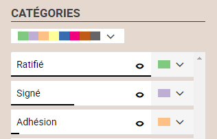
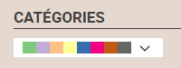
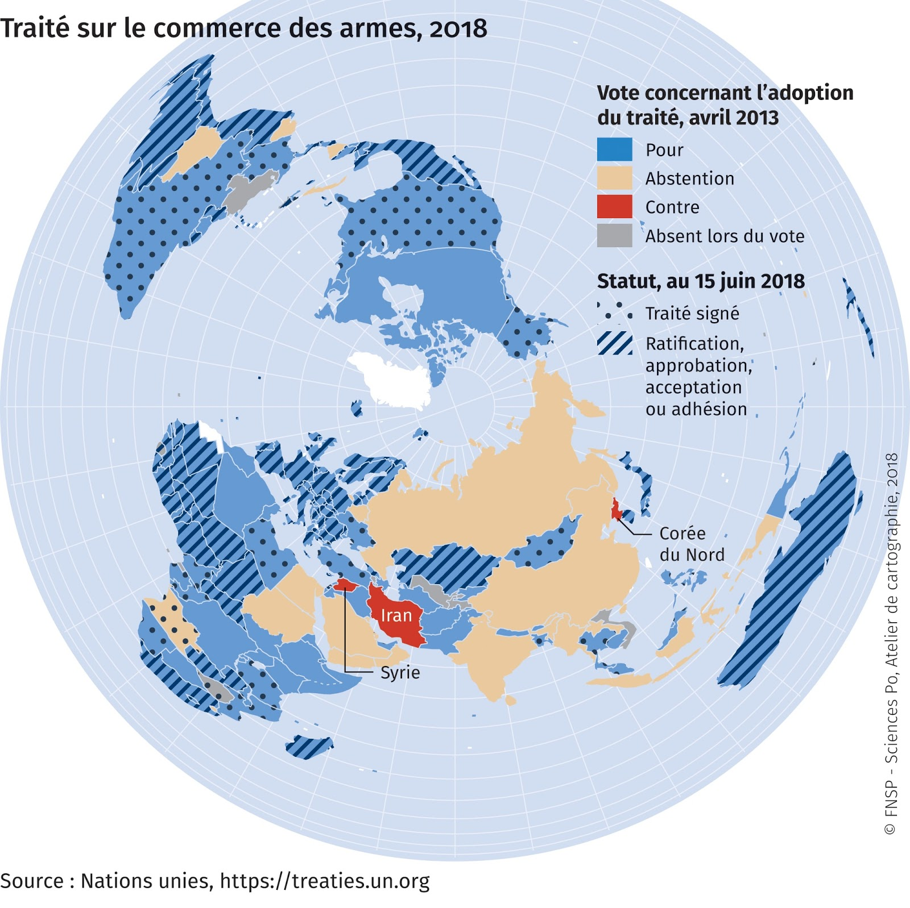

# Couleurs différentes
## Dans quel(s) cas utiliser cette viz ?
Pour **figurer des différences / des ressemblances** entre des informations qualitatives. Les **couleurs** différentes distinguent les catégories d’une variable.
Attention ! Dans un souci de visibilité, Khartis ne traitera automatiquement que les 8 catégories les plus rencontrées. A l’utilisateur de choisir manuellement des attributs aux autres. Ou alors de reprendre son jeu de données pour simplifier le nombre de catégories à traiter.

## Quels [types de données](../importer-des-donnees#types-de-donnees-reconnus) sont reconnus ?
Seules les **données liées à des surfaces** (pays, régions, wards…) sont prises en compte. Khartis colorie alors les polygones selon les informations de la variable choisie.

## Paramètres de la viz
**Catégories** : Elles s’affichent automatiquement depuis la variable sélectionnée. L’ordre d’apparition est fonction du nombre d'occurrences dans chacune de ces catégories. Ce nombre est symbolisé par le trait horizontal noir sous le nom. Dans l’exemple ci-dessous, les pays qui ont ratifié sont environ deux fois plus nombreux que ceux qui n’ont que signé.

**Pré-sélections de couleurs** : Khartis propose 4 palettes de couleurs pré-établies, plus ou moins contrastées/pastels.

**Personnalisation de la couleur** : l’utilisateur peut affiner les différences/ressemblances en choisissant ses propres couleurs. Par exemple, un petit ensemble de pays, peu visibles, pourra prendre un ton foncé alors qu’un groupe très étendu aura une teinte plus douce.

## Cas pratiques
**1 : Quel est l’encadrement du commerce mondial des armes ?**  
Carte extraite de « Proliférations » Espace mondial l'Atlas, 2018, [en ligne], consulté le 06/12/2018, URL:
https://espace-mondial-atlas.sciencespo.fr/fr/rubrique-(in)securites/article-4A04-proliferations.html
Cette carte essaie de montrer 2 choses : d’une part le vote des Etats au moment de l’adoption du Traité (en avril 2013) et d’autre part leur engagement depuis. Les “bons élèves” sont les Etats qui cumulent du bleu (vote POUR) et des hachures.

Accès au [dataset pour refaire la carte](.assets/data/4-Couleurs-differentes-Traite-commerce-armes-2018.csv)  
Accès au [projet Khartis](.assets/data/4-Couleurs-differentes-Traite-commerce-armes-2018-Projet-Khartis.kh.zip) de la carte du Traité sur le commerce des armes
