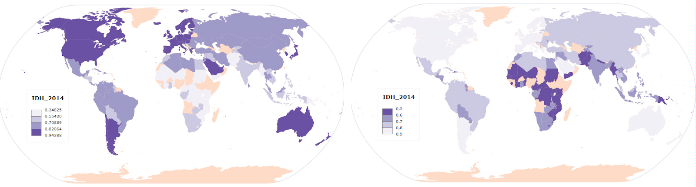
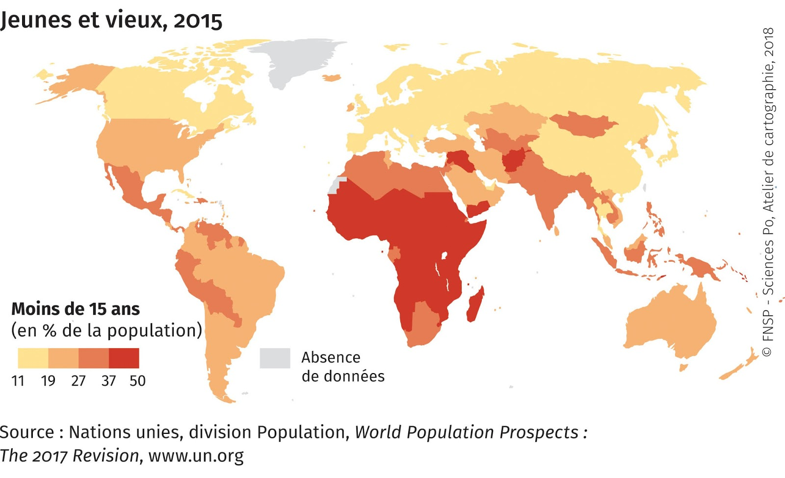
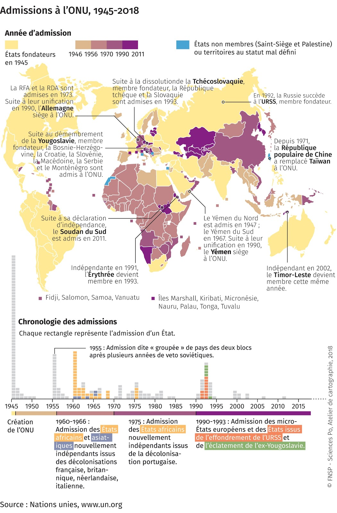

# Couleurs ordonnées
## Dans quel(s) cas utiliser cette viz ?
Pour **figurer des ordres de grandeur**. Cette visualisation permet une simplification de l'information initiale. Les données de la série statistique sont regroupées en classes (on parle de [discrétisation](../discretisation)). On figure souvent les fortes valeurs en foncé et les plus faibles en clair.
## Quels [types de données](../importer-des-donnees#types-de-donnees-reconnus) sont reconnus ?
**1 / Regrouper les données en classes ?**
La variable doit comporter des nombres (stocks, dates). Les données sont généralement continues, c'est à dire qu'il existe autant de valeurs qu'il y a d'individus dans la série statistique. Cela fait beaucoup : les valeurs semblables ou homogènes sont regroupées dans des classes pour simplifier le message. C’est l’opération dite de la [discrétisation](../discretisation).

**2 / Figurer des catégories pré-existantes ?**
Chaque couleur est une catégorie parmis celles de la série. Les données peuvent êtres des nombres (dates) ou du texte (ex : élevé, moyen, faible). Dans les deux cas, l’ordre des classes suit l’ordre des catégories.

FOND DE CARTE : Seuls les objets géographiques définis par des polygones pourront servir à cette visualisation. Par exemple des pays, des régions, des wards...

## Paramètres de la viz
**Discrétisation** : au **choix 6 découpages** sont proposés. 5 sont statistiques et automatiques (intervalles réguliers, moyennes emboîtées, quantiles, standardisation et Jenks). Une sixième option permet de fixer manuellement les seuils (seuils manuels).

**Classes** : entre 2 (minimum) et 8 (maximum). Les possibilités varient selon le choix de la discrétisation. Cette visualisation ayant pour objectif de réduire l’information, les concepteurs de Khartis ont volontairement limité le nombre de classes ; l’oeil ne distingue pas un nombre trop important de niveaux de couleurs ordonnées.

**Couleurs** : nuances dans une même teinte ou d’une teinte vers une autre selon le nombre de classes défini dans “Classes” (camaïeu jaune clair>rouge foncé ou jaune clair>bleu foncé) qui vont du très clair (valeurs faibles) au très foncé (valeurs fortes).  
exemple : 

**Valeur de rupture** : automatiquement réglée à 0 si coexistent des valeurs négatives et positives. L'utilisateur peut fixer une valeur-seuil pour davantage différencier, par une gamme double divergente, les valeurs plutôt fortes de celles plutôt faibles.  
exemple : 

## Habillage de la viz
**Inverser** : permet de mettre en avant les valeurs fortes ou faibles selon l’approche voulue. Par exemple dans le cas de l’IDH (cartes ci-dessous), on pourra montrer les pays développés (carte de gauche) ou plutôt ceux en développement (carte de droite).

## Cas pratiques
**1 : Où sont plutôt les très jeunes dans le Monde ?**  
Réponse : en Afrique et dans certains pays du Moyen-Orient, d’Asie ou du continent américain, avec cette carte des moins de 15 ans par pays en 2015 (extrait de « Vieux et jeunes, la dynamique des populations » Espace mondial l'Atlas, 2018, [en ligne], consulté le 22/11/2018, URL:
https://espace-mondial-atlas.sciencespo.fr/fr/rubrique-contrastes-et-inegalites/article-1A04-vieux-et-jeunes-la-dynamique-des-populations.html)

**Trucs et astuces** :
* Alléger graphiquement sa carte en masquant les graticules (méridiens et parallèles) et les frontières, via l’option Personnaliser dans l’onglet Export.  

**2 : Comment cartographier les vagues d’adhésion à l'ONU ?**  
Soit le cas des admissions des Etats à l’Organisation des Nations unies.  
Les dates sont bien ici des nombres (et pas du texte). On peut fixer des bornes pertinentes par le biais de la discrétisation manuelle.
Carte extraite de « Organisations internationales » Espace mondial l'Atlas, 2018, [en ligne], consulté le 23/11/2018, URL:
https://espace-mondial-atlas.sciencespo.fr/fr/rubrique-strategies-des-acteurs-internationaux/article-3A01-organisations-internationales.html

**Trucs et astuces** :
* Le réglage “Inverser” peut servir à mettre l’accent sur les premiers pays entrés à l’ONU ou les derniers ; selon que l’on veut privilégier l’ordre chronologique ou antéchronologique.
