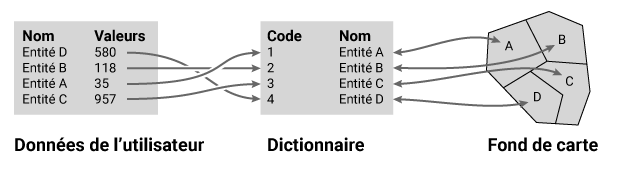
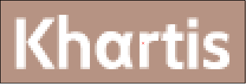
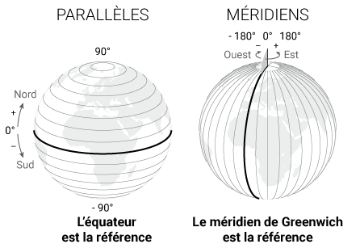
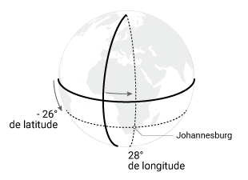

## Diagramme de fréquence
(à venir)

***

## Dictionnaire d'un fond de carte
Le dictionnaire est un tableau répertoriant les entités géographiques qui sont associées à un fond de carte. Par exemple pour un fond de carte de la France par département, le dictionnaire contient la liste des 101 départements.

Ce fichier est le pivot indispensable au géoréférencement de données fournies par l’utilisateur de Khartis. C’est à dire relier les données de l’utilisateur au dictionnaire et donc au fond de carte.

Pour que ce lien soit le plus transparent possible aux yeux de l’utilisateur, des variantes d’une même entité géographique sont inscrites dans le dictionnaire. Ses variantes proviennent de codes officiels internationaux et nationaux (ISO, NUTS, INSEE…) et de traductions.

**Exemple de la France dans le fond Monde :**

| iso_a2 | iso_a3 | iso_n3 | name_formal_EN  | name_ISO_EN | name_ISO_FR | name_UN_ES | name_UN_RU | name_UN_CN | name_UN_AR |
|------------|------------|------------|------------------------|------------------|-------------------|------------------|------------------|------------------|------------------|
| FR     | FRA    | 250    | French Republic | France      | France (la) | Francia    | Франция    | 法国       | فرنسا      |

**Exemple du département de la Seine-Maritime dans le fond France :**

| NUTS  | INSEE | ISO 3166-2 | Nom            |
|---------|---------|------------------|------------------------|
| FR232 | 76    | FR-76      | Seine-Maritime |

***

## Discrétisation
(à venir)

***

## Fichier .csv
Un fichier d’extension .csv, pour *comma-separated values*, est un fichier texte au format ouvert (non propriétaire). Chaque ligne de texte est une ligne du tableau et les virgules séparent les cellules du tableau.

**Extrait d’un fichier .csv :**
ISO3, Pays, Population 2015 (millions)
AFG, Afghanistan, 32.5
ALB, Albanie, 2.9
DZA, Algérie, 39.7

**Représentation de l’extrait sous forme de tableau :**

| ISO3 | Pays        | Population 2015 (millions) |
|*********|******************-|******************************************|
| AFG  | Afghanistan | 32.5                       |
| ALB  | Albanie     | 2.9                        |
| DZA  | Algérie     | 39.7                       |

Le format .csv peut être généré et ouvert par les logiciels de tableur propriétaires ou libres. Par exemple : Excel, LibreOffice, OpenOffice, Google Sheets...

***

## Fichier .svg
Un fichier d’extension .svg, pour *Scalable Vector Graphic*, est un fichier dit vectoriel au format ouvert (non propriétaire). L’image qui le compose repose sur l’association de coordonnées à des formes géométriques de base (point, ligne, surface). Ce format présente l’avantage de pouvoir être modifié sans perte : agrandissement, réduction, déplacement, rotation…

On l’oppose généralement au format matriciel ou raster qui ne peut être agrandi sans subir une perte de qualité d’image.

**Format matriciel ou raster :**   

**Format vectoriel :**   

***

## lat/long (coordonnées géographiques)
Les coordonnées géographiques permettent de localiser précisément un lieu sur la Terre à l’aide de deux valeurs d’angles appelées latitude et longitude. La valeur de chaque angle est défini par rapport à une référence appelé parallèle d’origine (l’équateur) pour la latitude et méridien d’origine (Greenwich) pour la longitude.

La latitude indique le positionnement Nord-Sud d’un point sur Terre. Sa valeur est l’angle formé entre le plan de référence, l’équateur, et un point sur Terre. Elle s’étend de -90° au pôle Sud à 90° au pôle Nord. Le cercle qui relie tous les points de même latitude est parallèle au plan de l’équateur.

La longitude indique le positionnement Est-Ouest d’un point sur Terre. Sa valeur est l’angle formé entre le méridien de Greenwich et un point sur Terre. Elle s’étend de -180° Ouest à 180° Est. La ligne qui relie tous les points de même longitude du pôle Nord au pôle Sud est appelé “ méridien ”.

Plusieurs notations du couple latitude / longitude sont possibles mais principalement deux sont utilisées : degrés sexagésimaux (ou degrés minutes secondes) et degrés décimaux.

Prenons l’exemple de Johannesburg en Afrique du Sud dont la position est :
+   26° 12′ 16″ Sud, 28° 2′ 44″ Est en degrés sexagésimaux
+   -26.204444°, 28.045556° ou 26.204444° Sud, 28.045556° Est en degrés décimaux

***

## Projection cartographique
(à venir)
