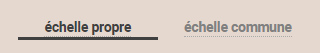
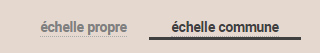
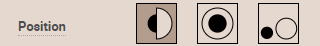
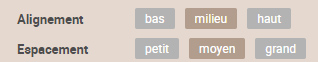
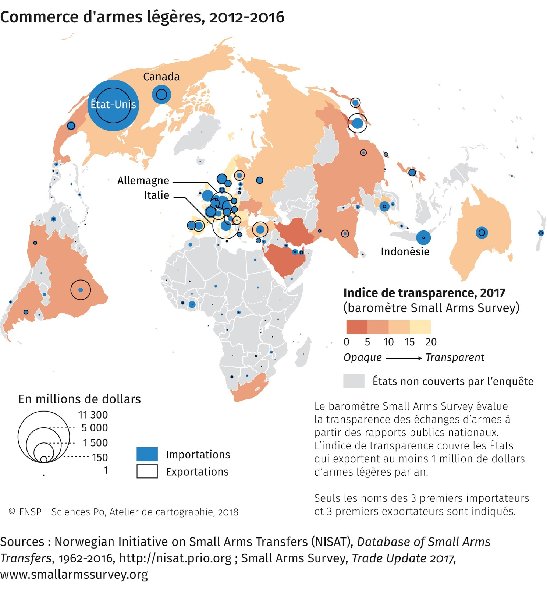

# Doubles symboles proportionnels
## Dans quel(s) cas utiliser cette viz ?
Pour **figurer 2 quantités** (nombres, stocks, volumes…). Les **tailles** des objets seront par défaut non-comparables. Khartis ne sait pas si les 2 quantités sélectionnées ont la même unité et sont de ce fait comparables. Les 2 points figurant les valeurs maximum de chacune des séries auront la même taille : on dit que les légendes sont “propres” à chacune des séries (voir image ci-dessous).

Pour **comparer 2 quantités de même unité** : si les 2 variables sélectionnées ont une même unité (par exemple une production agricole en quintaux, à deux dates) alors l’utilisateur devra activer l’échelle commune. La légende aura dès lors un seul système pour interpréter les tailles des points et 2 caissons colorés pour identifier les 2 variables.

## Quels [types de données](../importer-des-donnees#types-de-donnees-reconnus) sont reconnus ?
D’abord des **nombres** sont indispensables en entrée pour créer des symboles proportionnels.
Ensuite 2 possibilités : des **données géographiques liées à des surfaces** (pays, régions, wards…) ou **seulement identifiées par un couple de coordonnées**. Dans ce dernier cas, Khartis prendra comme référence géographique les informations dans 2 colonnes du tableau de données (les latitudes et les longitudes), créera les points (la géométrie) dont la taille variera.

## Paramètres de la viz
**Position** : Au **choix 3 positions** sont proposées : 1/ des demi-symboles juxtaposés (par défaut), 2/ superposés ou 3/ placés côte-à-côte.

**Forme** : **2 formes** sont proposées, des disques (par défaut) ou des des carrés. Khartis propose volontairement un nombre limité de formes.

**Taille** : Un curseur permet d’agrandir/réduire homothétiquement la taille de tous les symboles sur la carte. Par défaut sur 10 (taille relative de la valeur MAX de la variable statistique représentée), cette règle manipulée via le curseur varie de 5 à 56. Possibilité de saisir sa propre valeur MAX.

**Contraste** : Il comprime ou dilate la taille des symboles pour en changer la "lecture" normale et l'optimiser. Par défaut, le curseur est sur un rapport surface du point=quantité (donc strictement proportionnel). Les auteurs de Khartis reprennent le principe dit des "échelles extensives" énoncé par [Jacques Bertin](http://www.hypergeo.eu/spip.php?article630) dans son ouvrage *La graphique et le traitement graphique de l'information* (Flammarion, 1977).  
Voir aussi [Contraste](../contraste).

## Habillage de la viz
Si l’utilisateur choisit l’option 3 (symboles placés côte-à-côte), il aura alors la possibilité de choisir leur **alignement** vertical et aussi leur **espacement** relatif (cf image ci-dessous)

## Cas pratiques
**1 : Comment montrer, en même temps, les exportations et les importations d’armes légères** et ainsi voir si certains Etats sont plutôt exportateurs ou plutôt importateurs ?  
Sans calculer un solde commercial, pour apprécier les volumes échangés.  
Carte extraite de « Proliférations » Espace mondial l'Atlas, 2018, [en ligne], consulté le 07/12/2018, URL:
https://espace-mondial-atlas.sciencespo.fr/fr/rubrique-(in)securites/article-4A04-proliferations.html

Accès au [dataset pour refaire la carte](./assets/data/8-Double-symboles-proportionnels-Commerce-armes-legeres-2012-2016.csv)  
Accès au [projet Khartis](./assets/data/8-commerce-armes-legeres-2012-2016-Projet-Khartis.kh.zip) de la carte du commerce des armes
