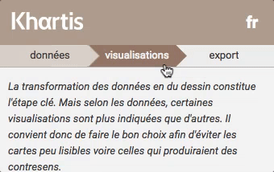
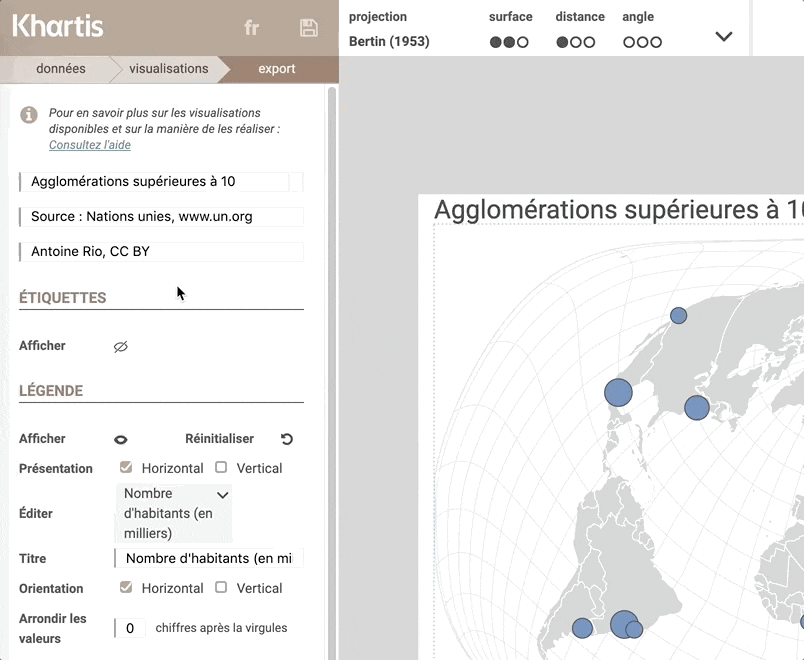
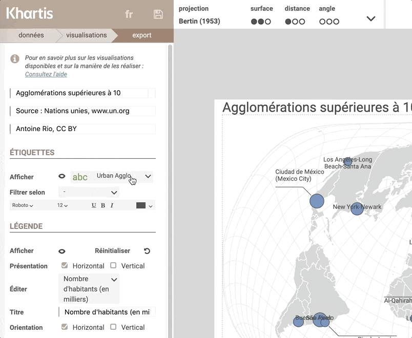
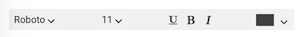

Nous allons ici voir comment ajouter et gérer au mieux le placement des étiquettes sur la carte.
On appelle ici ‘étiquettes‘ les textes qui identifient des symboles ou des polygones de la carte.

Pour ce tutoriel, nous allons reprendre une partie des données sur l'urbanisation, utilisées dans le tutoriel ['Premiers pas avec Khartis (2)'](../premiers-pas-avec-Khartis-(2), à savoir les agglomérations de plus de 10 millions d'habitants dans le monde, en 2015.
Pour suivre cet exercice, vous pouvez [récupérer ces données directement ici](./assets/agglo-2015.csv) (clic droit 'enregistrer le lien sous').

## Ajout des étiquettes

Une fois vos données importées et qu'une visualisation a été ajoutée à votre carte, vous pouvez passer dans la partie 'export' de Khartis, où nous y trouvons la fonctionnalité ‘Étiquettes‘.

Dans le volet gauche de réglages, dans la partie 'Étiquettes', cliquer sur l'icône symbolisant un oeil barré, près du texte 'Afficher'.

Sélectionner ensuite la variable qui contient les textes que vous voulez afficher en étiquettes. Il s'agit ici des noms des agglomérations contenus dans la variable 'Urban Agglo'.

Après cette manipulation, le nom de chaque agglomération est affiché sur la carte.

## Filtrer les étiquettes

Pour gagner en lisibilité, il peut être nécessaire de réduire le nombre d'étiquettes à l'aide d'un filtre.
Pour notre cas, nous allons réduire le nombre d'étiquettes au nombre de 10, en affichant les noms des 10 plus grandes agglomérations.
Pour cela, nous allons augmenter le seuil minimum du filtre à 18 millions d'habitants.

## Placement des étiquettes

Notre carte contient maintenant les noms des 10 agglomérations les plus peuplées en 2015. Hors, le placement de ces textes n'est pas toujours idéal.
Nous allons alors déplacer ces textes sur la carte, simplement à l'aide d'un cliquer-glisser.
Selon le placement de l'étiquette, un trait fin peut relier le texte au symbole ou polygone en lien avec ce texte.

## Personnaliser les étiquettes

Tout comme le titre, la source et la signature de la carte, le style de texte des étiquettes est aussi modifiable via ce bandeau d'édition de texte.

