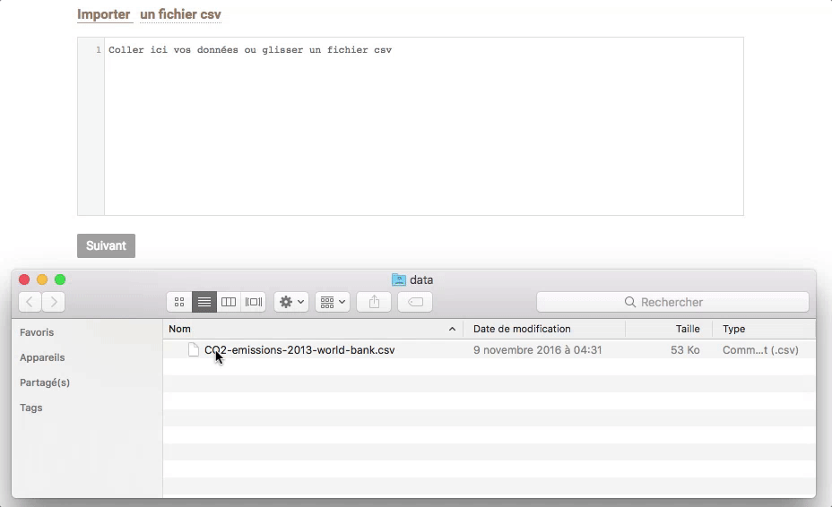
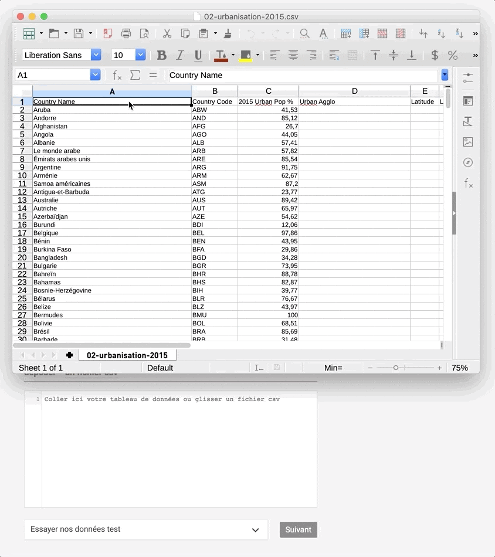

# Importer des données

Dans Khartis il existe trois manières de charger des données :

1 cliquer sur ‘Importer’ et sélectionner le [fichier csv](../definitions#fichier-csv) là où il est rangé

2 glisser le [fichier csv](../definitions#fichier-csv) depuis son dossier directement dans le cadre

3 copier-coller les données directement depuis un logiciel de tableur ouvert

## Types de données reconnus

Il existe deux types de données que Khartis est en mesure de traiter.

### Les données avec niveaux administratifs

Composées de données relatives aux niveaux administratifs du fond de carte sélectionné. Par exemple avec le fond monde, les données doivent être par État ou territoire. Tandis qu’avec la France par département, les données doivent concerner tout ou partie des départements français.

Pour être certain que vos données soit bien reconnues, Khartis possède plusieurs variantes de nom associé à un même objet géographique (un département, un pays). C’est ce qu’on appelle le [dictionnaire](../definitions#dictionnaire-dun-fond-de-carte) et cela vous permet d’utiliser des noms de pays en différentes langues, des codes nationaux de régions. En cas de non-reconnaissance d’éléments de vos données, vous pouvez manuellement les associés aux bons objets géographiques du fond de carte.

### Les données avec coordonnées géographiques

Composées de lieux à placer grâce à des [coordonnées géographiques (latitude/ longitude)](../definitions#latlong-coordonnees-geographiques). Le rapport au fond de carte est alors plus souple, à condition que tous les lieux soient inclus dans le cadrage du fond de carte. Par exemple si avec un fond Europe vous utilisez des données de population des 100 premières villes du monde, vous ne verrez qu’une partie des données, toutes les villes des autres continents ne seront pas représentées.

La reconnaissance des données nécessite à minima deux colonnes dans votre tableau : une de latitude et une de longitude. Les coordonnées doivent être sous la forme de degrés décimaux. Par exemple la position de Johannesburg en Afrique du Sud est :

| latitude    | longitude  |
|-------------|------------|
| -26.204444° | 28.045556° |
