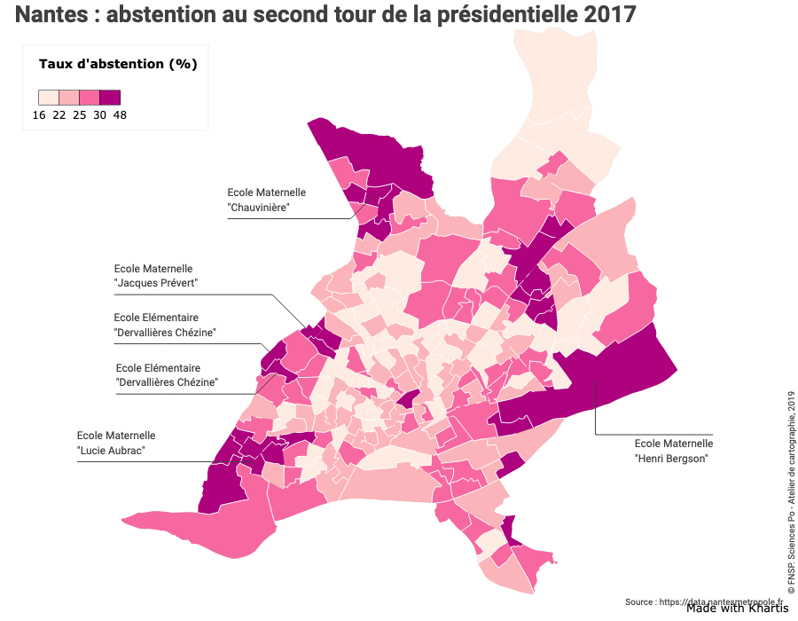
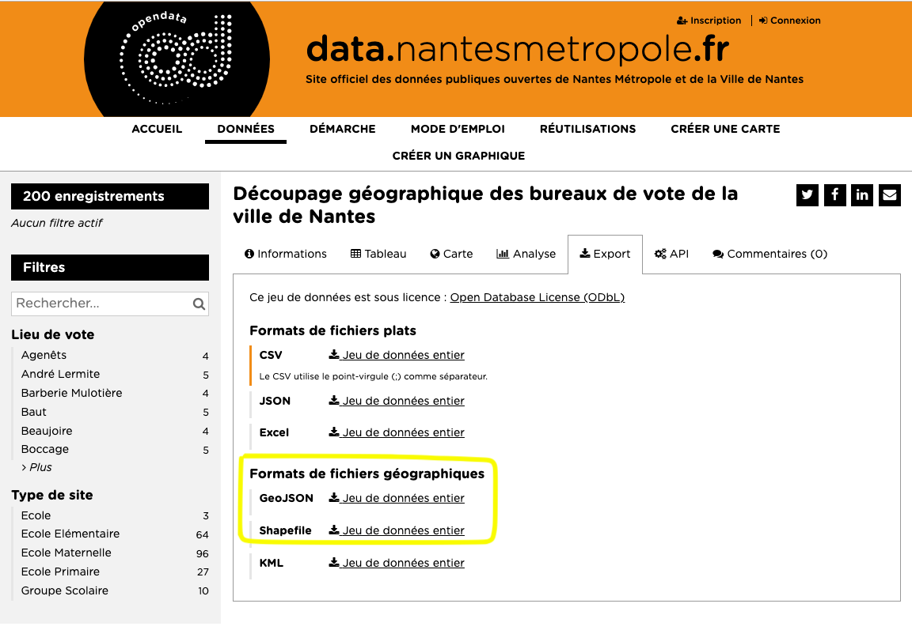
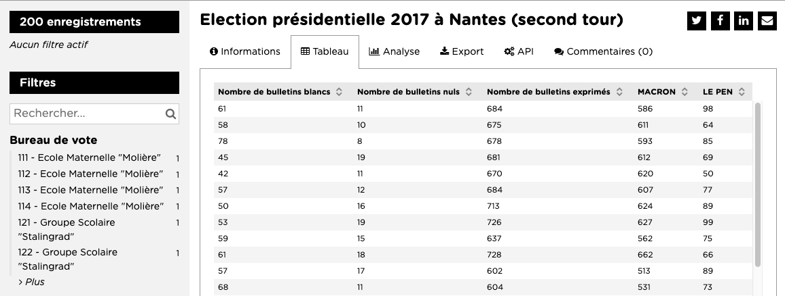
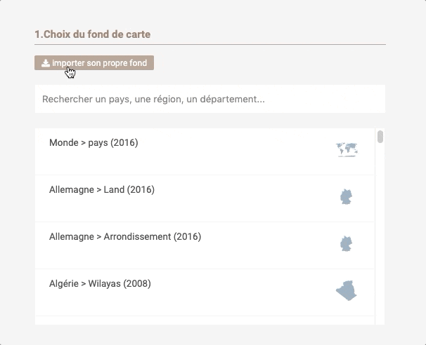
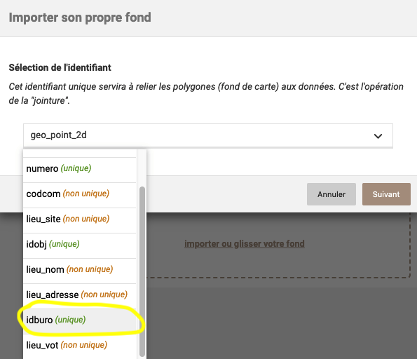
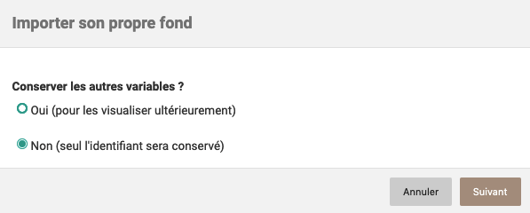
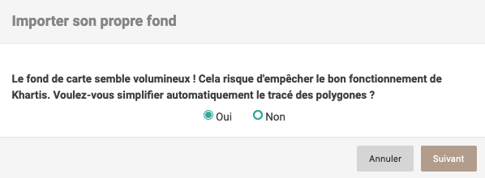
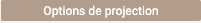

Nous allons réaliser une carte de l'abstention au second tour de l'élection présidentielle de 2017, à Nantes et par bureau de vote.

## Récupérer le fond de carte
La plateforme open data de Nantes met à disposition [le découpage géographique des bureaux de vote de la ville](https://data.nantesmetropole.fr/explore/dataset/244400404_decoupage-geographique-bureaux-vote-nantes/export/?disjunctive.lieu_nom&disjunctive.lieu_site).
Plusieurs formats d'export sont disponibles dont deux sont compatibles avec Khartis : geojson et shapefile.

Nous allons utiliser le format geojson que vous pouvez [récupérer directement ici](./assets/decoupage-geographique-bureaux-vote-nantes.geojson) (clic droit 'enregistrer le lien sous').

> **Notion clé**
> Khartis supporte trois formats :
-   geojson (contenu dans un seul fichier à l'extension .geojson ou .json)
-   shapefile (en fait au moins 3 fichiers avec les extensions .shp, .dbf et .prj)
-   topojson (contenu dans un seul fichier à l'extension .topojson ou .json)

## Récupérer les données
Maintenant que nous avons un fond de carte, il nous faut chercher des données électorales par bureau de vote. Cette même plateforme open data de Nantes propose [plusieurs résultats d'élections](https://data.nantesmetropole.fr/explore/?disjunctive.diffuseur&disjunctive.theme&disjunctive.features&disjunctive.publisher&disjunctive.gestionnaire&disjunctive.keyword&disjunctive.license&sort=explore.popularity_score&q=bureau+de+vote) à cette échelle.
Pour cet exemple nous choisissons les résultats du second tour de l'élection présidentielle de 2017 en [téléchargeant le format csv](https://data.nantesmetropole.fr/explore/dataset/244400404_election-presidentielle-2017-nantes-2nd-tour/export/?disjunctive.bureau_de_vote).
L'aperçu des données depuis la plateforme montre que les résultats sont exprimés en nombre de votes.

Pour envisager des visualisations plus riches et variés dans Khartis, il est possible de calculer les résultats en pourcentage à l'aide d'un tableur. Le [nouveau tableau après calculs est directement récupérable ici](./assets/Nantes-résultat-presidentielles-second-tour-2017-bureau-vote.csv).

## Importer le fond de carte dans Khartis
Nous pouvons ouvrir [Khartis](https://www.sciencespo.fr/cartographie/khartis). Pour visualiser les résultats du vote, il nous faut d'abord importer le fond de carte. Cette opération s'effectue en deux étapes : 1. cliquer sur le bouton "Importer son propre fond", 2. glisser ou sélectionner le fichier geojson récupéré précédemment.

En quelques étapes Khartis va tester et rendre compatible le fond de carte.

### 1. Sélection de l'identifiant
Le fond de carte importé contient des données propres, sous forme de variables. Celles-ci sont généralement organisées en colonnes. Une de ces variables permet d'identifier de manière unique chaque entité géographique du fond (chacun des bureaux de vote).
Dans notre cas elle s'appelle **idburo**, un numéro unique de bureau de vote.
Nous la sélectionnons et cliquons sur le bouton suivant.

### 2. Conserver les autres variables ?
Pour comprendre la raison de cette question, faisons un détour plus général avant de revenir à notre carte des élections.

> **Notion clé**
> Lorsque on importe son propre fond dans Khartis, deux cas de figures se présentent :
-   le fond contient les données que l'on veut représenter, par exemple une variable population dans un fond par commune.
-   le fond ne contient que la géométrie avec un identifiant. Il faut dans ce cas un fichier-tableau avec les données, distinct du fond.
>
> Dans le premier cas, Khartis permet de conserver les autres variables pour les visualiser ensuite.
Dans le second cas, seule la variable servant d'identifiant est conservée. Elle permettra de faire le lien avec le tableau de données qui devra comporter une variable avec les mêmes identifiants que ceux du fond de carte.

Revenons maintenant à notre fond des bureaux de vote à Nantes. Nous avons deux fichiers distincts, nous sommes dans le second cas : un fond de carte et un tableau de données.

### 3. Simplification (optionnel et selon le fond)
Cette étape n'apparait pas systématiquement et dépend du niveau de détail du fond de carte importé. Lorsque celui-ci est très détaillé, son poids augmente et Khartis peut être ralenti ou bloqué. Une simplification du tracé de la géométrie du fond est donc proposée. Khartis le fait de manière automatique et le tracé-résultat pourra présenter de légères différences avec le fond original.

### 4. Options de projection (optionnel)
Le fond que nous venons d'importer est présélectionné dans la liste et nous en avons un aperçu juste en dessous. Nous pourrions directement passer à l'import des données, mais il est possible, pour les utilisateurs avertis, de paramétrer la projection ; et cela plus finement que dans le précédent tutoriel [Premier pas avec Khartis (2)](../premiers-pas-avec-Khartis-(2)#projections).

> **Notion clé**
> Nous avons vu précédemment qu'un fichier de fond de carte contient des données organisées en variables. L'information sur la projection en fait aussi partie. Rappelons que la projection cartographique est l'étape mathématique qui transpose la Terre (une sphère) sur un plan en deux dimensions. Il existe des centaines de projections différentes avec des propriétés propres, plus ou moins adaptées selon les usages et les zones représentées. Une des projections les plus communes lors de la mise à disposition de fond cartographique est la [WGS84](https://fr.wikipedia.org/wiki/WGS_84).

Dans notre cas, en cliquant sur le bouton "Options de projection", on peut voir que le fond est déjà projeté en WGS84. Nous pouvons changer cette projection. En quoi est-ce utile ? Dans le cas de Nantes la projection WGS84 est inadaptée. Elle déforme trop les formes et les surfaces. La projection officielle utilisée en France, la [Lambert 93](https://fr.wikipedia.org/wiki/Projection_conique_conforme_de_Lambert#Lambert_93), est plus adaptée.

Pour les utilisateurs avertis, les projections sont entièrement personnalisables grâce à l'application d'un code proj4. Les possibilités deviennent alors quasi-infinies. Les sites [EPSG.io](https://epsg.io/) et [Projection Wizard](http://projectionwizard.org/) sont une bonne porte d'entrée dans ce vaste domaine.

## Importer les données et visualiser
À partir de maintenant les étapes sont similaires à celles présentées dans les deux tutoriels [Premier pas avec Khartis (1)](../premiers-pas-avec-Khartis-(1) et [Premier pas avec Khartis (2)](../premiers-pas-avec-Khartis-(2) :

-   Glisser déposer le fichier csv précédemment téléchargé ;
-   Vérifier que le bon identifiant est sélectionné et vérifier le typage des données (texte ou numérique) ;
-   Ajouter une ou des visualisations. Dans notre cas le taux d'abstention par bureau de vote à l'aide de la visualisation **couleurs ordonnées**. Pour en savoir plus sur les réglages consulter la [page d'aide dédiée](../couleurs-ordonnees) ;
-   Habiller la carte avec les éléments essentiels (titre, source, auteur) et facultatifs (étiquettes, personnalisation de la légende) ;
-   Sauvegarder et exporter la carte.

Un aperçu d'un résultat est disponible ci-dessous et le projet Khartis peut-être [récupéré directement ici](./assets/Projet-Khartis-Nantes-abstention-2017.kh.zip)

