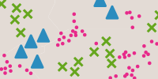

# Liste des visualisations disponibles

## **Visualisations représentant l'ordre**

### [Symboles proportionnels](symboles-proportionnels)

Les objets sont strictement comparables en taille

***

### [Couleurs ordonnées](couleurs-ordonnees)

L’ordre des valeurs/couleurs suit celui des données

***

### [Symboles ordonnées](symboles-ordonnes)

L’ordre des symboles suit celui des données

***
## **Visualisations représentant des différences**

### [Symboles différents](symboles-differents)

Des formes et/ou des couleurs différencient les objets

***

### [Couleurs différentes](couleurs-differentes)

Les couleurs différencient les objets

***
## **Visualisations combinant des variables**

### [Symboles proportionnels colorés (ordre)](symboles-proportionnels-colores-ordre)

Pour montrer une évolution entre deux dates (couleurs ordonnées) d’un phénomène (taille des symboles)

***

### [Symboles proportionnels colorés (différence)](symboles-proportionnels-colores-difference)

Figurer l’état à un instant T de phénomènes différents (couleurs) mais comparables (taille)

***

### [Double symboles proportionnels](double-symboles-proportionnels)

Comparer 2 informations
