Nous allons réaliser cette carte sur l’urbanisation dans le monde. Cette carte a pour particularité de superposer deux variables et d’utiliser des [coordonnées géographiques](../definitions#latlong-coordonnees-geographiques) pour la représentation d’un nombre d’habitants par ville, en symboles proportionnels.

## Récupérer et assembler les données

Nous allons tout d’abord télécharger les données relatives à la part des urbains. Celles-ci sont disponibles au format csv depuis le site de la [Banque mondiale](http://donnees.banquemondiale.org/indicateur/SP.URB.TOTL.IN.ZS).

Ensuite, nous allons télécharger les données permettant de représenter les grandes agglomérations. Ces données sont disponibles sur le site de la [Division Population des Nations Unies](https://esa.un.org/unpd/wup/CD-ROM/) au format xls (fichier ‘[WUP2014-F12-Cities_Over_300K.xls](https://esa.un.org/unpd/wup/CD-ROM/WUP2014_XLS_CD_FILES/WUP2014-F12-Cities_Over_300K.xls)’).

### Que contiennent les données ?

* La part de la population urbaine dans la population totale à différentes dates, de 1960 à 2015.

* Les agglomérations supérieures à 300 000 habitants, à partir de 1950 et avec des projections jusqu’en 2030.

    * Pour chaque ville, nous disposons des coordonnées géographiques (latitude, longitude).

### Traiter et regrouper les données

Afin de rendre notre carte plus lisible, nous allons ‘alléger’ l’information en ne gardant que les agglomérations supérieures à 10 millions d’habitants. Pour cela, à l’aide d’un tableur (LibreOffice, Excel ou encore Google Sheets) vous pouvez trier vos données selon le nombre d’habitants et ne garder que les agglomérations supérieures à notre seuil de 10 millions.

Ensuite, pour que Khartis puisse lire vos données, il est nécessaire d’assembler les deux tableaux données au sein d’un même tableau. Toujours à l’aide d’un tableur, nous allons regrouper les deux tableaux en un seul de façon à obtenir une structure similaire à celle figurant ci-dessous.

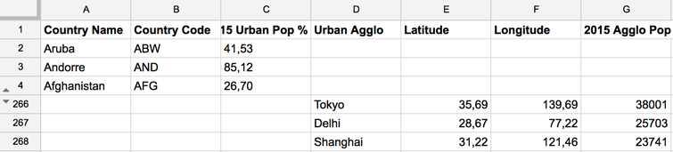

Pour ce tutoriel, vous pouvez aussi télécharger ce tableau [directement ici](./assets/02-urbanisation-2015.csv).

## Choisir le fond de carte

Revenons sur Khartis et choisissons le fond de carte sur lequel nous allons travailler. Les données sont à l’échelle mondiale alors nous choisissons ‘Monde > pays (2016)’.

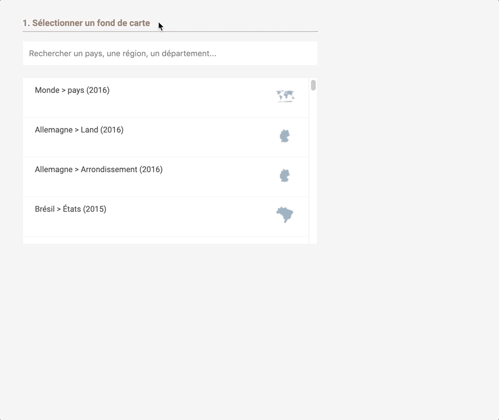

Une fois sélectionné, une vignette du fond de carte s’affiche accompagné d’un aperçu du [dictionnaire](../definitions#dictionnaire-dun-fond-de-carte).

## Importer les données

Vous pouvez charger des données de trois manières différentes :

* cliquer sur ‘Importer’ et sélectionner le [fichier csv](../definitions#fichier-csv) là où il est rangé

* glisser le fichier csv depuis son dossier directement dans le cadre

* copier-coller les données directement depuis un logiciel de tableur ouvert

Pour cette fois nous utiliserons la troisième option, un simple copier-coller à partir de notre tableur. Cliquer ensuite sur ‘suivant’

## Géoréférencer les données

Pour rappel, nous allons représenter deux variables. Celles-ci ne seront pas identifiées de la même manière par Khartis pour qu’elles puissent être représentées sur la carte.

Pour la part des urbains, les pays seront reconnus grâce au code ISO ou bien aux noms des pays. Pour les agglomérations, Khartis utilisera [la latitude et la longitude](../definitions#latlong-coordonnees-geographiques) de chaque ville pour les représenter sur la carte.

Nous allons tout d’abord ‘géoréférencer’ les données sur la part des urbain en sélectionnant comme référence géographique, la colonne ‘Country Code’, si Khartis ne l’a pas déjà fait pour vous.

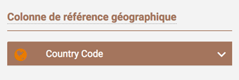

Nous pouvons au besoin corriger les cellules de la colonne qui n’auraient pas été reconnues en cliquant sur le texte d’erreur en rouge. Pour ce cas, les codes non reconnus concernent des régions définies par l’ONU.

Passons à l’étape suivante.

## Visualiser les données

Nous voulons tout d’abord représenter la part en 2015 à l’aide d’une carte choroplèthe (plages de couleurs plus ou moins intenses en couleur selon la part des urbains).

Cliquez sur le ‘+’ puis sélectionnez la variable à représenter ‘2015 Urban pop %’ et choisissez enfin la visualisation ‘valeurs > surfaces’.

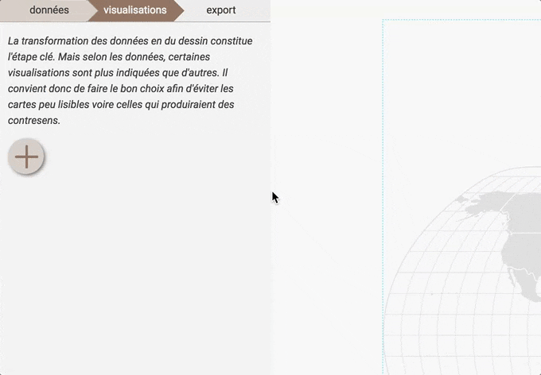

Maintenant les pays sont colorés selon la part d’urbains présente dans le pays et un volet de réglage de la visualisation est ouvert.

Nous pouvons choisir le mode de discrétisation (découpage en classes) ainsi que le gradient de couleur pour cette variable.

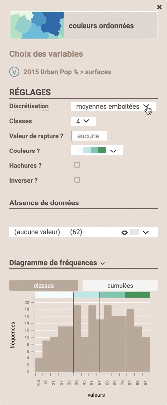

_Pour en savoir plus sur les discrétisations, [cliquez ici](../discretisation)._

Cette première variable représentée, nous pouvons ensuite passer à la seconde, à savoir les agglomérations de plus de 10 millions habitants.

Géoréférencer les données

Il s’agit maintenant de ‘géoréférencer’ cette deuxième variable à l’aide de [coordonnées géographique](../definitions#latlong-coordonnees-geographiques). Pour cela, fermez le volet de réglage et revenez à la première étape en cliquant sur l’onglet ‘données’.

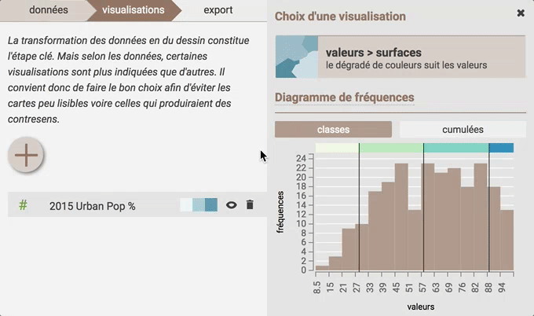

Si cela n’a pas été fait automatiquement par Khartis, nous devons identifier les colonnes latitude et longitude comme telles et ensuite choisir comme ‘colonne de référence géographique’, ‘Latitude/Longitude’.

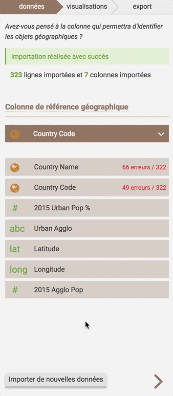

## Visualiser les données

Après avoir cliqué sur l’onglet ‘visualisations’, cliquez sur le ‘+’ , sélectionnez la variable à représenter, à savoir  ‘2015 Agglo Pop’ et choisissez enfin la visualisation ‘valeurs > symboles’. Vous verrez ainsi apparaître chacune des agglomérations de plus de 10 millions habitants grâce aux points proportionnels représentant leurs populations.

Le volet de réglage de la visualisation s’est ouvert pour régler entre autre la taille, la forme et la couleur de vos symboles.

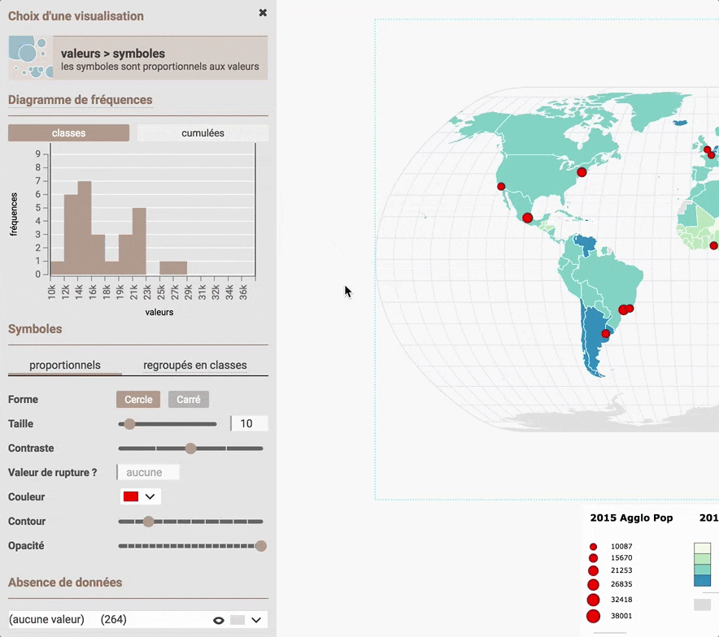

Attention : le fonctionnement de Khartis peut être ralenti lorsqu’un grand nombre de points est représenté.

### Projections

Khartis vous propose différentes manières de voir le monde au travers de plusieurs projections cartographiques. Vous pouvez la choisir à tout moment dans l’élaboration de votre carte, sans perturber les paramètres de celle-ci. Nous allons ici changer de projection en choisissant la ‘Briesemeister’.

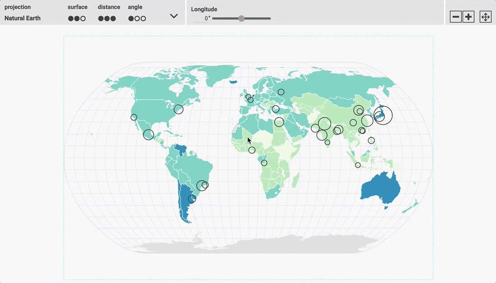

_Pour en savoir plus sur les projections disponibles, [cliquez ici](../les-projections-disponibles)._

## Export

Les deux variables représentées, nous pouvons maintenant passer à l’étape suivante en cliquant sur l’onglet ‘export’.

### Habillage

Cette étape permet d’ajouter tous les éléments textuels nécessaires à la bonne compréhension de la carte, à savoir une source, un entête de légende, et un crédit.

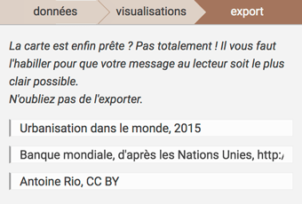

Pour modifier l’entête de légende, cliquez simplement sur le texte.
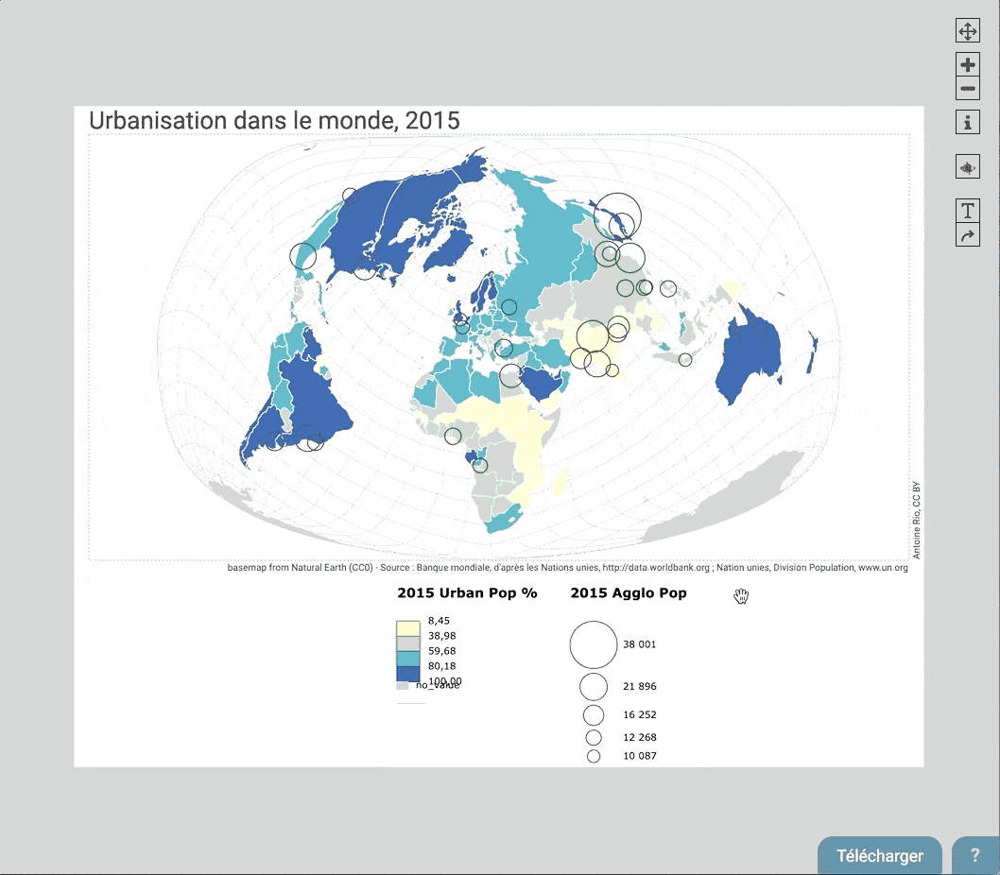

### Mise en page

Une fois la carte complétée avec ces éléments textuels assurant une bonne lecture de celle-ci, nous pouvons améliorer la mise en page avec trois paramètres :

* les dimensions du document sont matérialisées en blanc et se distinguent du fond gris. Ce sont la largeur et la hauteur en pixels modifiables depuis le panneau de réglage à gauche.

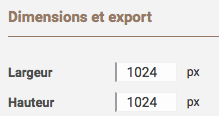

* les marges de la carte matérialisées par un tireté bleu.

* le placement de la légende qui peut être déplacée par cliquer-glisser.

On peut par exemple réduire la hauteur du document à 800px en essayant d’articuler au mieux la disposition des différents éléments grâce aux marge et en déplaçant la carte et sa légende.

### Format d’export

Khartis propose trois formats d’export :

* [png](https://fr.wikipedia.org/wiki/Portable_Network_Graphics) : format image. Adapté si on ne souhaite pas retoucher la carte.

* [svg](../definitions#fichier-svg) : format vectoriel. Adapté si on souhaite continuer à travailler la carte dans un logiciel de dessin.

* svg (optimisé illustrator) : meilleure compatibilité avec le logiciel Adobe Illustrator.

Ci-dessous un exemple de reprise du document sous un logiciel de dessin vectoriel.

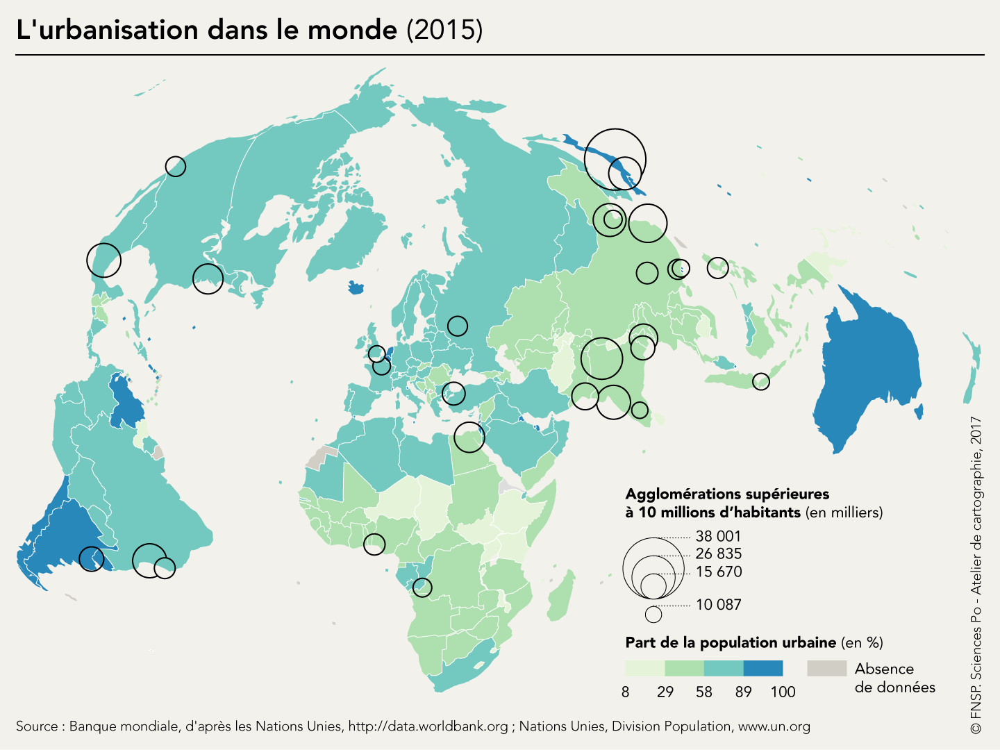
