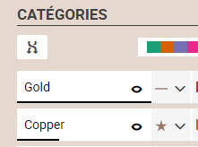
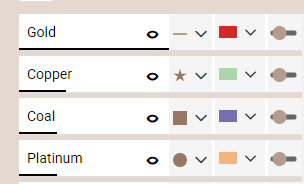
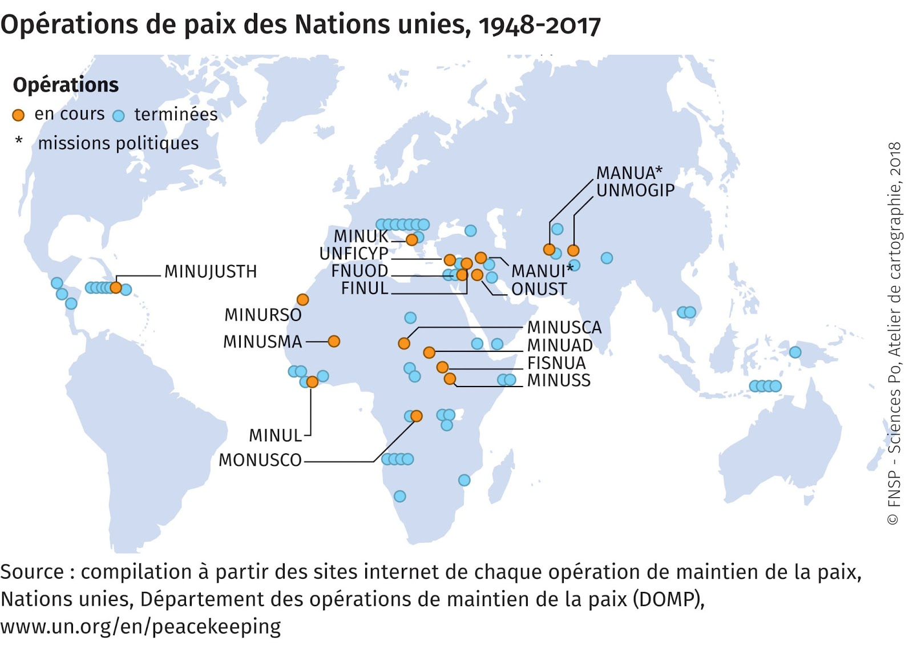
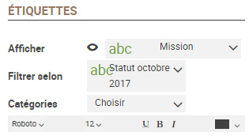
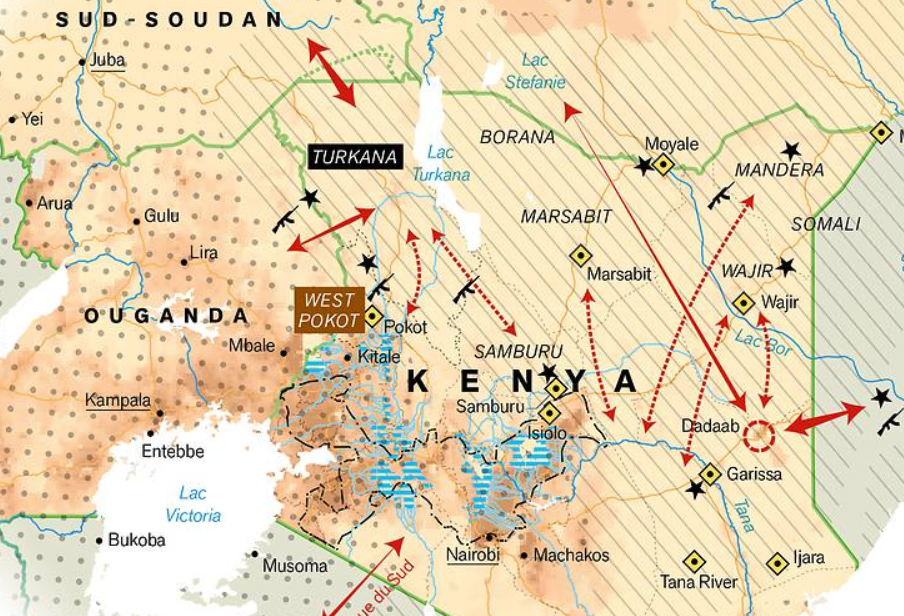

# Symboles différents
## Dans quel(s) cas utiliser cette viz ?
Pour **figurer des différences / des ressemblances** entre des informations qualitatives. Les formes combinées à des couleurs très différentes distinguent les catégories d’une variable.
Attention ! Dans un souci de visibilité, Khartis ne traitera automatiquement que les 8 catégories les plus rencontrées. A l’utilisateur de choisir manuellement des attributs aux autres.

## Quels [types de données](../importer-des-donnees#types-de-donnees-reconnus) sont reconnus ?
2 possibilités : des **données liées à des surfaces** (pays, régions, wards…) ou seulement cartographiables par un **[couple de coordonnées](../definitions#latlong-coordonnees-geographiques)**. Dans ce dernier cas, Khartis prendra comme référence géographique les informations dans 2 colonnes du tableau de données (les latitudes et les longitudes) et créera les points utiles (la géométrie).

## Paramètres de la viz
**Catégories** : Elles s’affichent automatiquement depuis la variable sélectionnée. L’ordre d’apparition est fonction du nombre d'occurrences dans chacune de ces catégories. Ce nombre est symbolisé par le trait horizontal noir sous le nom. Dans l’exemple ci-dessous, les gisements d’or (Gold) sont plus de 3 fois plus nombreux que ceux de cuivre (Copper) sur la carte.  

**Pré-sélections de couleurs et de formes** : Khartis propose des choix pré-établis accessibles en cliquant sur le bouton “aléatoire” (gauche de l’image ci-dessous) ainsi que 4 palettes de couleurs différentes plus ou moins contrastées ou dans des tons pastels (picker de droite).  

**Personnalisation de la forme, de la couleur et de la taille des symboles** : l’utilisateur peut affiner les différences/ressemblances en jouant sur l’un des ces paramètres. Par exemple, un seul gisement de cuivre risque de disparaître dans une région couverte de très nombreux gisement d’or. Ces derniers seront réduits à des symboles petits et légers alors que le gisement de cuivre sera figuré par un symbole gros et foncé. Seul l’oeil humain peut arriver à trouver un tel équilibre.  

## Cas pratiques
**1 : Distinguer les opérations de paix en cours/terminées des Nations unies depuis 1948**  
Carte extraite de « Maintenir la paix » Espace mondial l'Atlas, 2018, [en ligne], consulté le 29/11/2018, URL:
[https://espace-mondial-atlas.sciencespo.fr/fr/rubrique-(in)securites/article-4A07-maintenir-la-paix.html](https://espace-mondial-atlas.sciencespo.fr/fr/rubrique-(in)securites/article-4A07-maintenir-la-paix.html)  
Dans cette carte, toutes les missions passées et en cours sont représentées. Une variable (“en cours” / ”achevée”) permet de distinguer par la couleur les 2 types.
Conseil de cartographe : plusieurs missions peuvent se succéder en un même endroit. Pour rendre visible cette multitude, le cartographe prendra soin de décaler (dans un outil de dessin vectoriel) des points qui, sinon, sont strictement superposés dans l’outil.

Accès au [dataset pour refaire la carte](./assets/data/3-Symboles-differents-OPERATIONS-PAIX-1948-2017.csv)

**Trucs et astuces** :
* Afficher les noms des symboles à l’aide de l’option Étiquettes dans l’onglet Export. Par exemple afficher uniquement les noms des missions en appliquant les paramètres suivants et en choisissant la catégorie “en cours”.   

**2 : Comment faire une carte d’inventaire ?**  
Khartis ne permet malheureusement pas de laisser s’exprimer toute sa créativité. Il est cependant possible de retravailler son export-résultat dans un logiciel de dessin vectoriel et d’en changer les symboles. De nombreuses bibliothèques libres et en ligne existent, parmi lesquelles [The Noun Project](https://thenounproject.com).

Carte extraite de Gemenne, François, Dina Ionesco et Daria Mokhnacheva, Atlas des migrations environnementales, Paris, Presses de la Fondation nationale des sciences politiques, 2016 et [disponible ici](http://cartotheque.sciences-po.fr/media/Kenya__changement_climatique_et_migrations_pastorales/2091/)
