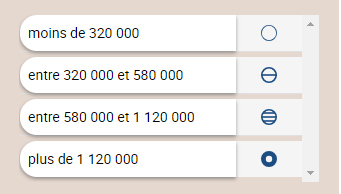
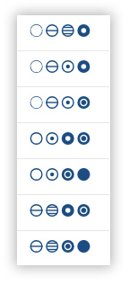
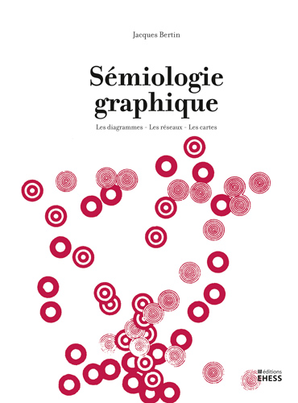
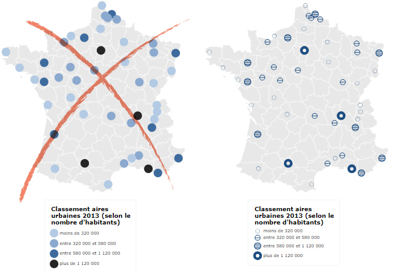

# Symboles ordonnés
## Dans quel(s) cas utiliser cette viz ?
Pour **figurer une hiérarchie (un ordre)**. C’est par exemple typiquement le cas des cartes administratives avec les chefs-lieux de régions, de départements, de communes… A la différence des [couleurs ordonnées](couleurs-ordonnees.md), cette visualisation ne réduit pas l’information.

## Quels [types de données](../importer-des-donnees#types-de-donnees-reconnus) sont reconnus ?
L’utilisateur doit préparer son jeu de données en “typant” ces classes selon une codification : ex. 1,2,3,4 ou alors fort, moyen, faible. Par souci de visibilité, Khartis ne distingue pas plus de 8 catégories ordonnées.

Attention : Khartis est malin mais il a ses limites. L’ordre affiché est fonction du tri des informations dans le tableau de données initial. La première occurrence rencontrée sera le type 1 (point le plus fort, en bas), la seconde le type 2, etc. Assurez vous qu’il y a concordance entre l’ordre de vos données et l’ordre des points. Si ce n’est pas le cas, vous pouvez permuter les onglets des catégories : les symboles restent en place.  

FOND DE CARTE : Cette viz fonctionne avec des **données liées à des surfaces** (pays, régions, wards…) ou seulement cartographiables par un [**couple de coordonnées**](../definitions#latlong-coordonnees-geographiques). Dans le premier cas, le point sera placé au centre du polygone. Dans le second cas, Khartis prendra comme référence géographique les informations dans 2 colonnes du tableau de données (les latitudes et les longitudes) et créera les points utiles (la géométrie).

## Paramètres de la viz
**Symboles** : Selon le nombre de catégories qu’il trouve, Khartis propose entre 1 gamme de points ordonnés (si 8 catégories) et jusqu’à 7 gammes (si, comme ici, 4 catégories). Ces gammes de points autorisent une bonne association des points identiques et en même temps permettent de distinguer les différentes catégories.
Leur dessin s’appuie sur les travaux de [Jacques Bertin](http://www.hypergeo.eu/spip.php?article630) et du Laboratoire de la graphique, publiés notamment dans [Sémiologie graphique](http://editions.ehess.fr/ouvrages/ouvrage/semiologie-graphique-1/), dont la couverture de la dernière édition (2013, aux Editions EHESS) reprend ces symboles.  
   

**Forme** : **3 formes** sont proposées, circulaires (par défaut), carrées et triangulaires. Khartis propose volontairement un nombre limité de formes.

**Taille** : en fonction de l’échelle (niveau de zoom), il est possible de varier la taille des symboles

## Habillage de la viz
L’utilisateur peut personnaliser la **couleur** des symboles et leur **opacité** (couche alpha).

## Cas pratiques
**1 : Comment établir une typologie des aires urbaines en France ?**
A la lecture de l’article [“Villes et communes de France”](https://www.insee.fr/fr/statistiques/2569312?sommaire=2587886#consulter) des Tableaux de l’économie française (édition 2017) de l’INSEE, et notamment du dernier tableau sur les principales aires urbaines, on peut se demander comment figurer au mieux ces “objets”.

Après une lecture de la documentation et une définition de l’aire urbaine, on peut travailler au choix sur 1/ la population municipale (le nombre de personnes en 2013) ou 2/ le nombre de communes dans chacune des aires ou encore 3/ un classement qui réduit en 4 types la population.

Sur la carte de gauche de l’image ci-dessous, des symboles identiques en forme (un disque) et seulement déclinés selon la couleur du fond ne suffisent pas à voir une hiérarchie/un ordre. La carte de droite, en utilisant la même forme de base, joue sur tout un ensemble de paramètres qui mettent bien en vue le classement des éléments.   
  

Accès au [dataset pour refaire la carte](./assets/data/5-Symboles-ordonnes-aires-urbaines-france-INSEE-2013.csv)  

**2 : Comment refaire (partiellement) la carte administrative de l’IGN français ?**
Pour refaire -seulement- la cartographie des types de chefs-lieux, partons du Code officiel géographique (COG) de l’INSEE. Les données sont disponibles à cette url : https://www.insee.fr/fr/information/2114819  
* Dans notre cas précis (la région comprise entre le Vaucluse, le Nord des Bouches-du-Rhône et une partie des Alpes-de-Haute-Provence) nous avons sélectionné les communes de ces 3 départements dans la base la plus à jour (communes existantes au 1er janvier 2016).
Le résultat donne des codes et des noms de communes mais pas d’informations pour les localiser précisément (latitude/longitude)
* Les superficies des communes étant très variables, les symboles ne seront pas localisés précisément où se trouve la commune, mais au centre du polygone figurant le territoire communal.
* A suivre (bientôt) : les données pour localiser précisément ces lieux (latitudes/longitudes)

  

Accès au [dataset pour refaire la carte](./assets/data/5-symboles-ordonnes-CHEFS-LIEUX-PACA-2016.csv)  
Accès au [projet Khartis de la carte](./assets/data/5-symboles-ordonnes-CHEFS-LIEUX-PACA-Projet-Khartis.kh.zip) de la typologie des communes de la région PACA, 2016
