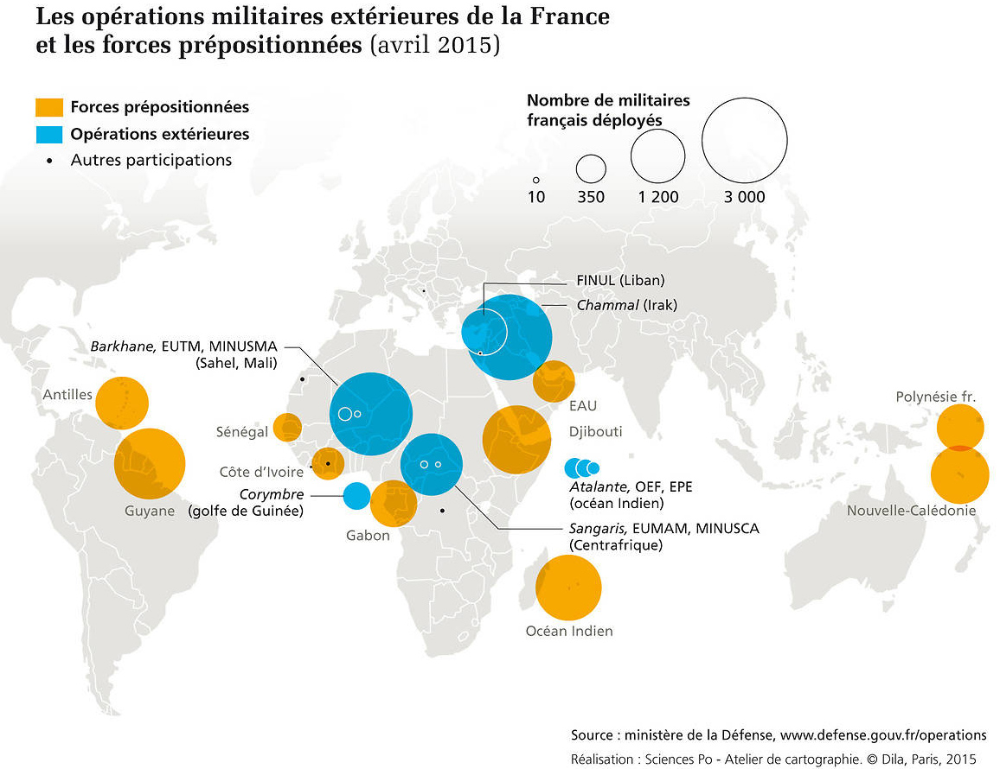

# Symboles proportionnels colorés (différence)
## Dans quel(s) cas utiliser cette viz ?
Pour montrer la géographie d’un phénomène quantitatif (la **taille** des points), et en même temps des différences (les **couleurs différentes** dans ces mêmes points).

## Quels [types de données](../importer-des-donnees#types-de-donnees-reconnus) sont reconnus ?
Des **nombres** sont indispensables en entrée pour créer des symboles proportionnels.  
En général du **texte** sert à définir les catégories que distinguent différentes couleurs à l’intérieur de ces symboles. Des nombres peuvent cependant définir des catégories (1, 2, 3…).

## Choix des variables
**Variable > Symboles** : Elle sert à construire des symboles de tailles proportionnelles aux valeurs. Note : possibilité de changer de variable par un clic sur [NomVariable >symboles].  

**Variable > Surfaces** :  des teintes différentes distinguent les catégories rencontrées dans la variable. Attention : les cellules vides seront considérées comme [aucune valeur] et constitueront une catégorie supplémentaire.

## Paramètres de la viz
**Symboles** : voir les paramètres des [Symboles proportionnels](symboles-proportionnels.md)  
**Surfaces** : voir les paramètres des [Couleurs différentes](couleurs-differentes.md)

## Cas pratiques
**1 : Où l’Armée française intervient-elle et dans quel(s) cadre(s) ?**   
Réponse : La France prépositionne des forces armées dans une bande centrale qui va de l’Amérique latine au Pacifique en passant par l’Afrique centrale et le Moyen-Orient., dans des DROM (Antilles, La réunion, Polynésie…) ou bien dans des Etats (Djibouti, EAU…). Elle intervient également dans ce que l’on appelle des opérations extérieures (ou Opex), dans le cadre de missions de paix des Nations unies (Liban), de missions de l’OTAN ou d’autres.

Carte extraite de DILA, *Questions internationales n°73-74* - mai-août 2015
et [disponible ici](http://cartotheque.sciences-po.fr/media/Les_operations_militaires_exterieures_de_la_France_et_les_forces_prepositionnees_avril_2015/749/)

Accès au [dataset pour refaire la carte](./assets/data/7-Symboles-proportionnels-couleurs-differentes-OPEX2015.csv)  
Accès au [projet Khartis](./assets/data/7-Opex-France-2015-Projet-Khartis.kh.zip) de la carte des Opex
