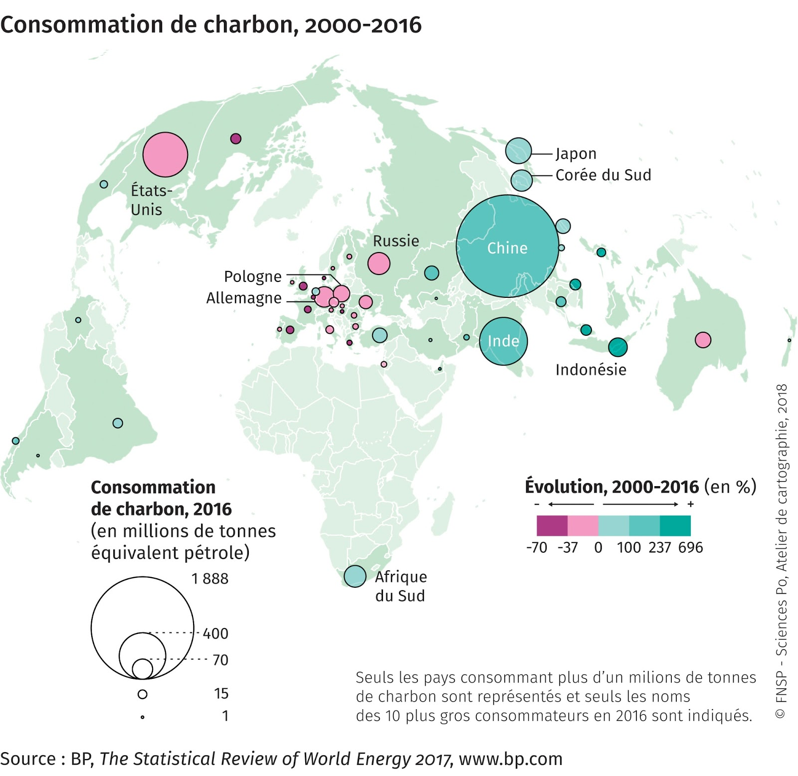
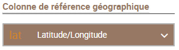
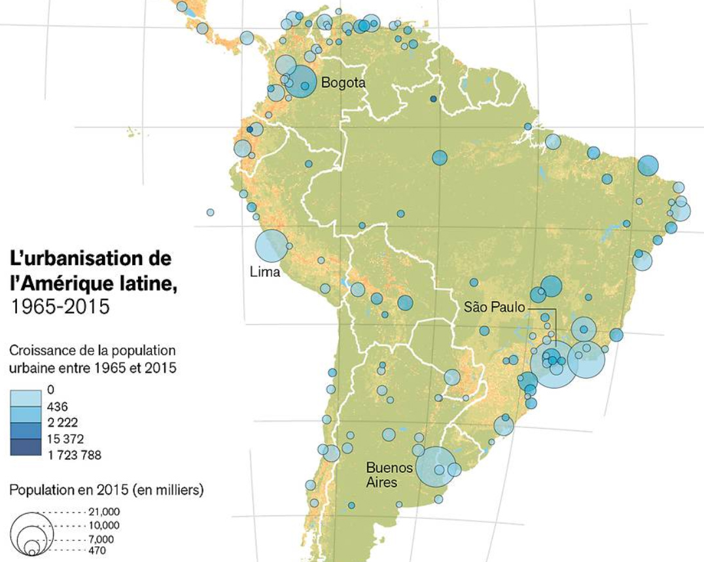

# Symboles proportionnels colorés (ordre)
## Dans quel(s) cas utiliser cette viz ?
Pour montrer la géographie d’un phénomène quantitatif (la **taille** des points) et en même temps 1/ son évolution dans le temps ou 2/ une seconde variable ordonnée (la **couleur ordonnée** dans ces mêmes points).

## Quels [types de données](../importer-des-donnees#types-de-donnees-reconnus) sont reconnus ?
Des **nombres** sont indispensables en entrée.
La croissance pouvant être positive ou négative, une gamme double divergente sera appliquée aux surfaces des points.  
Note : Khartis ne permet pas encore des calculs. Il faut préalablement préparer ses données en amont de l’outil, dans une feuille de calcul (par exemple GoogleSheet)

## Choix des variables
**Variable > Symboles** : Elle sert à construire des points de tailles proportionnelles aux valeurs. Note : possibilité de changer de variable par un clic sur [NomVariable >symboles].

**Variable > Surfaces** :  une gamme de nuances de couleurs traduit l’évolution du phénomène entre 2 dates. Si les valeurs n’ont qu’un signe alors la gamme n’aura qu’une dimension ; si l’évolution est positive et négative alors la gamme sera divergente (voir [Couleurs ordonnées](couleurs-ordonnees.md))

## Paramètres de la viz
**Symboles** : voir les paramètres des [Symboles proportionnels](symboles-proportionnels.md)  
**Surfaces** : voir les paramètres des [Couleurs ordonnées](couleurs-ordonnees.md)

## Cas pratiques
**1 : Quelle est l’évolution de la consommation de charbon dans le monde ces 15 dernières années ?**   
L’Europe s’en sépare, même si les tonnages restent encore élevés pour l’Allemagne ou la Pologne alors que l’Asie est très consommatrice, Chine et Inde en tête. Les Etats-Unis occupent une position particulière : en dépit d’une évolution à la baisse, le volume reste encore l’un des 3 premier au monde en 2016.
La carte montre le tonnage consommé (symboles proportionnels) à la dernière date de la période (2016) et l’évolution sur la période 2000-2016 (couleurs ordonnées à l’intérieur des symboles).
Carte extraite de « Énergies fossiles » Espace mondial l'Atlas, 2018, [en ligne], consulté le 23/11/2018, URL:
https://espace-mondial-atlas.sciencespo.fr/fr/rubrique-ressources/article-5A06-energies-fossiles.html

Accès au [dataset pour refaire la carte](./assets/data/6-Symboles-proportionnels-colores-CONSO-CHARBON-2000-2016.csv)

**2 : Quelle est la croissance des villes d’Amérique latine ?**  
Dans ce cas, le jeu de données doit comporter nécessairement 2 colonnes, longitude et latitude, pour figurer les points des villes. Le fond de carte des Etats ne sert alors que d’habillage.  
Bien penser à sélectionner “Latitude/Longitude” comme colonne de référence géographique à l’import des données dans Khartis.

Carte extraite de François Gemenne, Dina Ionesco et Daria Mokhnacheva, Atlas des migrations environnementales, Paris, Presses de la Fondation nationale des sciences politiques, 2016 et [disponible ici](http://cartotheque.sciences-po.fr/media/Lurbanisation_de_lAmerique_latine_1965-2015/2089/)

Accès au [dataset pour refaire la carte](./assets/data/6-Symboles-proportionnels-colores-URBANISATION-AMERIQUES-1965-2015.csv)
