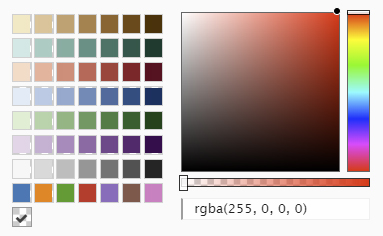
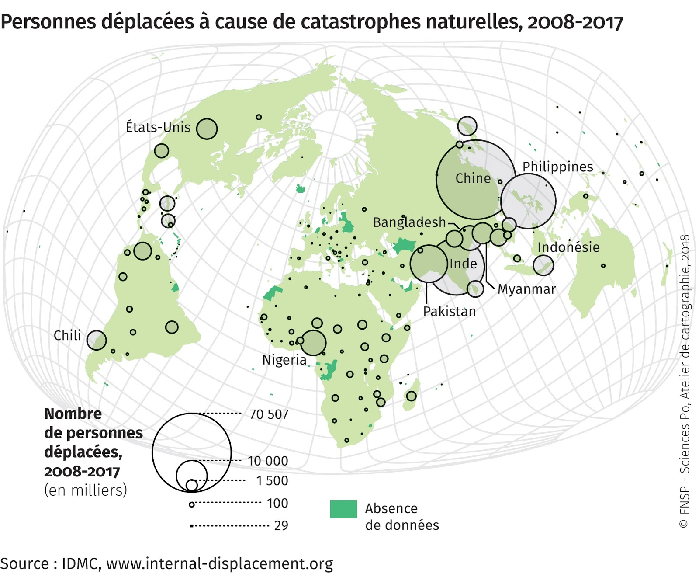
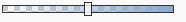
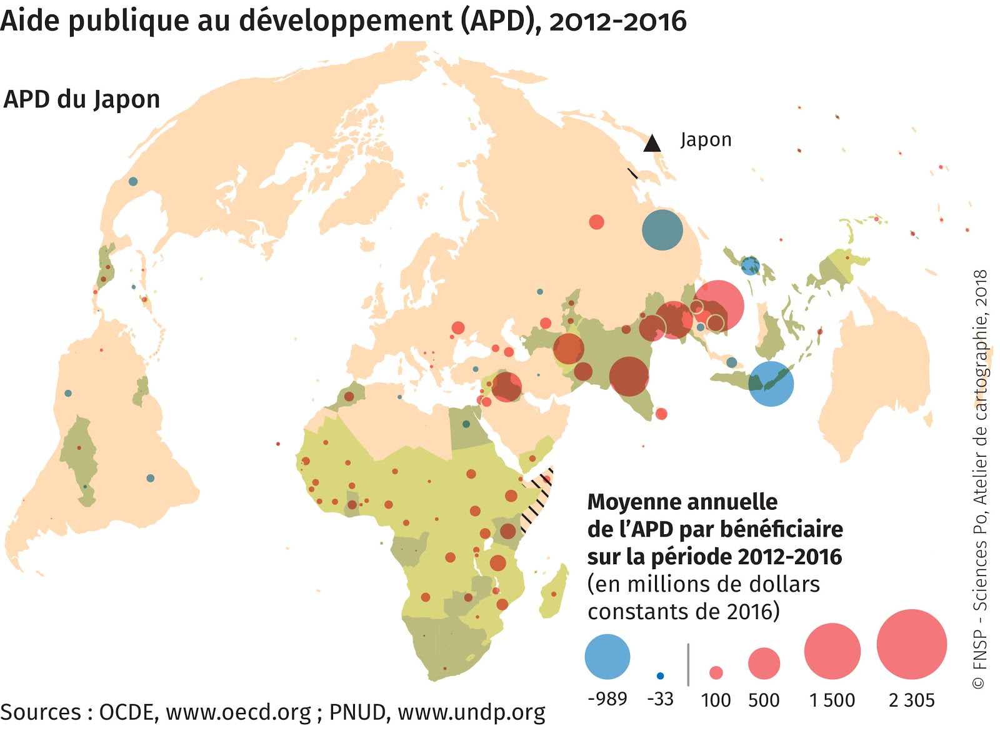
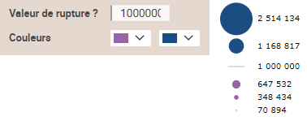

# Symboles proportionnels
## Dans quel(s) cas utiliser cette viz ?
Pour **figurer des quantités** (nombres, stocks, volumes…). Les **tailles** des objets seront comparables entre elles ; strictement -par défaut- selon le rapport surface du point=quantité ou encore selon un facteur qui permettra alors de mettre plus ou moins en avant les informations faibles et les plus fortes (voir aussi [le contraste](../contraste)).

## Quels [types de données](../importer-des-donnees#types-de-donnees-reconnus) sont reconnus ?
D’abord des **nombres** sont indispensables en entrée pour créer des symboles proportionnels.  
Ensuite 2 possibilités : des **données géographiques liées à des surfaces** (pays, régions, wards…) ou **seulement identifiées par un [couple de coordonnées](../definitions#latlong-coordonnees-geographiques)**. Dans ce dernier cas, Khartis prendra comme référence géographique les informations dans 2 colonnes du tableau de données (les latitudes et les longitudes), créera les points (la géométrie) dont la taille variera.
## Paramètres de la viz
**Forme** : Au **choix 3 formes** sont proposées : des disques (par défaut), des carrés et des barres verticales. Khartis propose volontairement un nombre limité de formes et non pas une large bibliothèque de pictogrammes qui ne permettraient pas de voir les rapports de proportion aussi bien qu’avec des éléments géométriques, simples.

**Taille** : Un curseur permet d’agrandir/réduire homothétiquement **la taille** de tous les symboles sur la carte. Par défaut sur 10 (taille relative de la valeur MAX de la variable statistique représentée), cette règle manipulée via le curseur varie de 5 à 56. Possibilité de saisir sa propre valeur MAX.

**Contraste** : Il comprime ou dilate la taille des symboles pour en changer la "lecture" normale et l'optimiser. Par défaut, le curseur est sur un rapport surface du point=quantité (donc strictement proportionnel).  
Les auteurs de Khartis reprennent le principe dit des "échelles extensives" énoncé par [Jacques Bertin](http://www.hypergeo.eu/spip.php?article630) dans son ouvrage *La graphique et le traitement graphique de l'information* (Flammarion, 1977).  
Voir aussi [le contraste](../contraste).
## Habillage de la viz
L’utilisateur pourra personnaliser ses symboles grâce à une **palette de couleurs**. Laquelle permet aussi de jouer sur la **transparence** (par défaut opacité 100%). Il peut aussi ajouter un **contour** aux symboles, et pourquoi pas, faire des cercles et non plus des disques (cf exemples plus bas).

## Cas pratiques
**1 : Comment dessiner des cercles vides ou quasi-vides** (et non pas des disques pleins) pour ne pas masquer le reste de la carte/le fond de carte ?  
Exemple : les personnes déplacées à cause des catastrophes naturelles, 2008-2017 (carte extraite de « Migrations environnementales » Espace mondial l'Atlas, 2018, [en ligne], consulté le 18/10/2018, URL:
[https://espace-mondial-atlas.sciencespo.fr/fr/rubrique-mobilites/article-2A05-FR-migrations-environnementales.html](https://espace-mondial-atlas.sciencespo.fr/fr/rubrique-mobilites/article-2A05-FR-migrations-environnementales.html))

Accès au [dataset pour refaire la carte](./assets/data/1-Symboles-proportionnels-DEPLACES-CAUSE-CATASTROPHES-NATURELLES-2008-2017.csv)  
Accès au [projet Khartis](./assets/data/1-deplaces-cause-catastrophes-naturelles-2007-2013.kh.zip) de la carte des déplacés liés aux catastrophes naturelles

**Trucs et astuces** :
* Manipuler le curseur de la **transparence** (panneau Couleur) pour réduire ou ôter le contenu du disque.

* Ajouter un **contour** aux symboles (par défaut aucun, curseur à gauche).

Le tour est joué !

**2 : Comment faire des points proportionnels avec une valeur de rupture ?**  
Vous souhaitez montrer des valeurs négatives/positives, comme dans le cas d’un solde naturel, d’une balance commerciale…).  
Exemple : Aide publique au développement (APD), 2012-2016 (carte extraite de « L’Europe acteur global » Espace mondial l'Atlas, 2018, [en ligne], consulté le 19/10/2018, URL:
[https://espace-mondial-atlas.sciencespo.fr/fr/rubrique-strategies-des-acteurs-internationaux/article-3A05-l-europe-acteur-global.html](https://espace-mondial-atlas.sciencespo.fr/fr/rubrique-strategies-des-acteurs-internationaux/article-3A05-l-europe-acteur-global.html))

Khartis détecte automatiquement la présence du signe négatif, comme dans l’exemple ici. L’outil traite les valeurs absolues ave  c des symboles proportionnels et attribue des couleurs (modifiables) aux points pour différencier les signes - et +. La Valeur de rupture 0 ne peut pas être changée, dans ce cas et seulement celui-ci.

Accès au [dataset pour refaire la carte](./assets/data/1-Symboles-proportionnels-APD-Japon-2012-2016.csv)  
Accès au [projet Khartis](./assets/data/1-APD-Japon-2012-2016-Projet-Khartis.kh.zip) de la carte de l’aide publique au développement du Japon

**Trucs et astuces** :
* Si toutes les données de la série ont un même signe, l’utilisateur peut décider de séparer, par deux couleurs, des données faibles/fortes selon une borne de son choix.
La **valeur de rupture** permet de distinguer les symboles proportionnels dont les valeurs lui sont inférieures et supérieures. Dans l’exemple ci-dessous, la valeur arbitraire 1 million a été choisie.  

